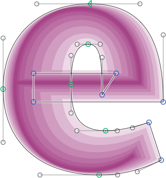

# ShowInterpolations.glyphsReporter

This is a plugin for the [Glyphs font editor](http://glyphsapp.com/) by Georg Seifert.
It calculates all active instances for the given glyph and draws them behind your paths.
By default, it draws all active instances on top of each other using a transparent fuchsia/lavender color:

After installation, it will add the menu item *View > Show Interpolations* (Cmd-Shift-J).
You can set a different keyboard shortcut in System Preferences.

### Installation

1. Download the complete ZIP file and unpack it, or clone the repository.
2. Double click the .glyphsReporter file. Confirm the dialog that appears in Glyphs.
3. Restart Glyphs

### Usage Instructions

1. Open a glyph in Edit View.
2. Use *View > Show Interpolations* (Cmd-Shift-J) to toggle the preview of the instances.

### Custom Parameter

To only view specific interpolations, add this custom parameter to the instance(s) you want to preview:

    Property: ShowInterpolation
    Value: -
    Value: .1;.8;.2
    Value: 1;0.5;0;0.1

The Value defines the color of the instance. You can either leave the value blank to use the default color. Or, you can set semicolon-separated RGB values between 0 and 1. If you supply a fourth value, it will be interpreted as alpha (opacity).

### System Requirements

This plugin needs Glyphs 1.4.3 or later, running on OS X 10.7 or later. It has only been tested on OS X 10.9.2, though.

### License

Copyright 2014 Rainer Erich Scheichelbauer (@mekkablue).
Based on sample code by Georg Seifert (@schriftgestalt).

Licensed under the Apache License, Version 2.0 (the "License");
you may not use this file except in compliance with the License.
You may obtain a copy of the License at

http://www.apache.org/licenses/LICENSE-2.0

See the License file included in this repository for further details.
