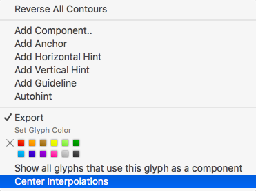

# ShowInterpolations.glyphsReporter

This is a plugin for the [Glyphs font editor](http://glyphsapp.com/) by Georg Seifert.
It calculates all active instances for the given glyph and draws them behind your paths.
By default, it draws all active instances on top of each other using a transparent fuchsia/lavender color:

After installation, it will add the menu item *View > Show Interpolations* (de: *Interpolationen zeigen*, fr: *Montrer Interpolations*, es: *Mostrar Interpolaciones*).
You can set a keyboard shortcut in System Preferences.

### Installation

Please install the plugin via the built-in Plugin Manager, available via *Window > Plugin Manager*. If this is not possible for some reason or another, follow these steps:

1. Download the complete ZIP file and unpack it, or clone the repository.
2. Double click the `.glyphsReporter` file. Confirm the dialog that appears in Glyphs.
3. Restart Glyphs

### Usage Instructions

1. Open a glyph in Edit View.
2. Use *View > Show Interpolations* to toggle the preview of the instances.

To center the interpolations under the frontmost layer, Ctrl- or right-click anywhere in the canvas to invoke the context menu, and choose 
*Center Interpolations* 
(de: *Interpolationen zentrieren*, 
fr: *Centrer interpolations*, 
es: *Centrar interpolaciones*). 

To toggle the setting back, open the context menu again, and choose *Do Not Center Interpolations* (de: *Interpolationen nicht zentrieren*, es: *No centrar las interpolaciones*, fr: *Ne pas centrer les interpolations*).

Alternatively, you can also align at a certain node. To do that, select a node, bring up the context menu, and choose 
*Align Interpolations at Selected Node* 
(de: *Interpolationen an ausgewähltem Punkt ausrichten*,
es: *Alinear las interpolaciones a nodo seleccionado*,
fr: *Aligner les interpolations au point selectionné*).
The node in question will then be marked with a star. To cancel point alignment, select the starred node, and choose 
*Do not Align Interpolations at Selected Node*
(de: *Interpolationen nicht an ausgewähltem Punkt ausrichten*,
es: *No alinear las interpolaciones a nodo seleccionado*,
fr: *Ne pas aligner les interpolations au point selectionné*)
from the context menu.

### Custom Parameter

To only view specific interpolations, add this custom parameter to the instance(s) you want to preview:

    Property: ShowInterpolation
    Value: -
    Value: .1;.8;.2
    Value: 1;0.5;0;0.1

The Value defines the color of the instance. You can either leave the value blank to use the default color. Or, you can set semicolon-separated RGB values between 0 and 1. If you supply a fourth value, it will be interpreted as alpha (opacity).

### Requirements

The plugin needs Glyphs 2.3 or higher, running on OS X 10.9.5 or later.

### License

Copyright 2014 Rainer Erich Scheichelbauer (@mekkablue).
Based on sample code by Georg Seifert (@schriftgestalt).

Licensed under the Apache License, Version 2.0 (the "License");
you may not use this file except in compliance with the License.
You may obtain a copy of the License at

http://www.apache.org/licenses/LICENSE-2.0

See the License file included in this repository for further details.
