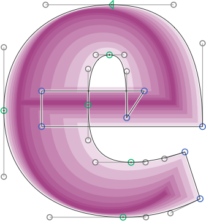

# Show Interpolations

This is a plugin for the [Glyphs font editor](http://glyphsapp.com/) by Georg Seifert.
It calculates all active instances for the given glyph and draws them behind your paths.
By default, it draws all active instances on top of each other using a transparent fuchsia/lavender color:



After installation, it will add the menu item *View > Show Interpolations* (de: *Interpolationen zeigen,* fr: *Montrer Interpolations,* es: *Mostrar Interpolaciones,* zh: 💗插值).
You can set a keyboard shortcut in System Preferences.

### Installation

Please install the plugin via the built-in Plugin Manager, available via *Window > Plugin Manager*. If this is not possible for some reason or another, follow these steps:

1. Download the complete ZIP file and unpack it, or clone the repository.
2. Double click the `ShowInterpolations.glyphsReporter` file. Confirm the dialog that appears in Glyphs.
3. Restart Glyphs

### Usage Instructions

1. Open a glyph in Edit View.
2. Use *View > Show Interpolations* to toggle the preview of the instances.

### Custom Parameter

To only view specific interpolations, add this custom parameter to the instance(s) you want to preview in *File > Font Info > Exports:*

    Property: ShowInterpolations
    Value: -
    Value: .1;.8;.2
    Value: 1;0.5;0;0.1

The Value defines the color of the instance. You can either leave the value blank to use the default color. Or, you can set semicolon-separated RGB values between 0 and 1. If you supply a fourth value, it will be interpreted as alpha (opacity: 1.0 = opaque, 0.0 = invisible).

If you want to change the color *globally,* add the parameter in *File > Font Info > Font > Custom Parameters.*

**Legacy note:** In older versions of the plugin, the parameter was called `ShowStyles` or `ShowInterpolation`.

### Extra Settings

If you want the plug-in to also display inactive instances, run this in Macro Window:

```python
Glyphs.defaults["com.mekkablue.ShowInterpolations.showDisabledStyles"] = True
```

### Deprecated Plugins

This repository also contains two older Python-based reporter plugins:

- **Show Interpolation** (`ShowInterpolation.glyphsReporter`): the original predecessor.
- **Show Styles** (`ShowStyles.glyphsReporter`): the Glyphs 3 update of the predecessor.

These plugins are no longer maintained. Please install `ShowInterpolations.glyphsReporter` instead.

### Requirements

The plugin needs Glyphs 3 or higher, running on macOS 10.15 or later.

### License

Copyright 2014-2024 Rainer Erich Scheichelbauer (@mekkablue).
Based on sample code by Georg Seifert (@schriftgestalt) and Jan Gerner (@yanone).

Licensed under the Apache License, Version 2.0 (the "License");
you may not use this file except in compliance with the License.
You may obtain a copy of the License at

http://www.apache.org/licenses/LICENSE-2.0

See the License file included in this repository for further details.
